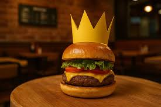

# 🍓🍓🍓🍓🍓 Grupo - "Moranguinhos do Amor" 🍓🍓🍓🍓🍓
PEI EE Profº Nestor Gomes de Araujo
Trabalho desenvolvido para a Maratona TECH - 2025
Alunos(as):
- 🍓Sara Cristina Branco da Silva - 2A;
- 🍓Luana Gabriele Pereira da Rocha - 2A;
- 🍓Giovana Lemes Boaventura - 2A;
- 🍓Lívia Fernanda Santos da Costa - 2A;
- 🍓Carlos Silvério Gonçalves - 3B.

## Professores 
👨‍🏫 Felipe Rodrigues dos Santos
👨‍🏫 João Vitor Solano


## 🆘 Sobre o Projeto

Esse um projeto de fachada que simula um site de delivery de comida. No entanto, seu propósito real é muito mais crítico: oferecer um canal de denúncia discreto e seguro para mulheres em situação de violência doméstica.

A ideia é que a vítima, coagida em casa e sem poder fazer uma ligação, possa usar o site para pedir "ajuda" como se estivesse pedindo "comida", acionando as autoridades de forma anônima e sem levantar suspeitas.

## 🤫 Como Funciona?

O site apresenta uma interface comum de um restaurante ou serviço de delivery. A usuária pode navegar por um cardápio, adicionar itens ao carrinho e finalizar um "pedido".

O "pedido", na verdade, é um formulário de denúncia disfarçado. Ao preenchê-lo com informações cruciais (que podem ser disfarçadas como "detalhes do pedido" ou "endereço de entrega"), um alerta é enviado para uma central de ajuda (que em uma implementação real, seria a polícia ou uma organização de apoio).

## ✨ Funcionalidades

- **Interface Discreta:** Aparência de um site de comida para não gerar desconfiança.
- **Anonimato:** Garante que a denúncia possa ser feita de forma segura.
- **Simplicidade:** Fácil de usar, mesmo em uma situação de estresse.
- **Código Aberto:** Qualquer pessoa pode contribuir, melhorar ou replicar o projeto.

## ⚠️ Atenção!

Este projeto, em seu estado atual, é uma **simulação** e uma **prova de conceito**. Para ser utilizado de forma real, ele precisa ser conectado a um sistema que de fato acione as autoridades competentes, como a Polícia Militar (190) ou a Central de Atendimento à Mulher (180).

## 🚀 Ajude a Replicar este Projeto!

Quer criar um projeto semelhante para ajudar pessoas em sua comunidade? Use o prompt abaixo com uma Inteligência Artificial como o GitHub Copilot para gerar a base do seu próprio site:

```prompt
Crie um projeto de site de uma página com HTML, CSS e JavaScript com o tema de "delivery de comida". O site deve ter:
1.  Um cabeçalho com o nome "Cardápio Expresso".
2.  Uma seção de "cardápio" com pelo menos 6 pratos fictícios, cada um com nome, descrição e um botão "Pedir".
3.  Um rodapé com informações de contato falsas.
4.  O design deve ser limpo e moderno.
5.  O JavaScript deve simular a adição de itens a um carrinho, e o botão "Finalizar Pedido" deve abrir um modal (pop-up) com um formulário.
6.  Este formulário, disfarçado de "Endereço de Entrega e Detalhes", deve na verdade ser um formulário de denúncia de violência doméstica, solicitando discretamente o endereço da ocorrência e um campo para descrever o pedido de ajuda. O botão de envio deve ter o texto "Confirmar Pedido".
```

---

💜 **Violência contra a mulher é crime. Denuncie. Disque 180.** 💜

## 💻 O Coração do Código

Para entender como a mágica acontece, aqui estão as partes essenciais do código, com comentários explicando cada detalhe.

### `index.html` (Estrutura dos Gatilhos)

No HTML, definimos `id`s específicos para os itens do cardápio que servirão como gatilhos secretos. Também há um `id` no link do rodapé para um gatilho alternativo.

```html
<!-- ... código anterior ... -->
<section class="menu">
    <h2>Lanches</h2>
    <div class="menu-items">
        <!-- ... outros itens do menu ... -->

        <!-- ESTE É UM ITEM GATILHO -->
        <div class="menu-item" id="trigger1">
            
            <h3>X-Tudo Especial da Casa</h3>
            <p>O favorito da galera, completo e saboroso.</p>
            <span class="price">R$ 25,00</span>
        </div>

        <!-- ... outros itens do menu ... -->

        <!-- ESTE É OUTRO ITEM GATILHO -->
        <div class="menu-item" id="trigger2">
            
            <h3>Lanchão Premium</h3>
            <p>Ingredientes selecionados para um sabor único.</p>
            <span class="price">R$ 28,00</span>
        </div>

        <!-- ... outros itens do menu ... -->
    </div>
</section>
<!-- ... código posterior ... -->
<footer class="ifood-footer">
    <div class="footer-column">
        <h2>iFood</h2>
        <!-- ... outros links ... -->
        <!-- ESTE É O GATILHO DE CLIQUE TRIPLO NO RODAPÉ -->
        <a href="#" id="security-link">Conta e Segurança</a>
        <!-- ... outros links ... -->
    </div>
</footer>
```

### `script.js` (A Lógica da Ação)

Este script é o cérebro do sistema. Ele "ouve" os cliques nos elementos definidos e executa a ação de emergência.

```javascript
// Adiciona um "ouvinte" que espera todo o conteúdo da página (HTML) ser carregado antes de executar o código.
document.addEventListener('DOMContentLoaded', () => {
    
    // Cria uma lista (array) com os nomes dos IDs dos elementos que funcionarão como gatilhos de emergência.
    const emergencyTriggers = ['trigger1', 'trigger2', 'trigger3'];
    
    // Itera (passa por cada item) sobre a lista de IDs de gatilhos.
    emergencyTriggers.forEach(id => {
        // Para cada 'id' da lista, busca o elemento HTML correspondente.
        const element = document.getElementById(id);
        
        // Verifica se o elemento com o 'id' procurado realmente existe na página.
        if (element) {
            // Se o elemento existir, adiciona um "ouvinte" de evento de clique a ele.
            element.addEventListener('click', () => {
                // Quando o elemento for clicado, exibe uma caixa de diálogo de confirmação.
                if (confirm('Você está prestes a ligar para a emergência (190). Deseja continuar?')) {
                    // Se o usuário clicar em "OK", o navegador tentará iniciar uma chamada para o número 190.
                    window.location.href = 'tel:190';
                }
            });
        }
    });

    // Busca no HTML o elemento com o ID 'security-link' (o link "Conta e Segurança" no rodapé).
    const securityLink = document.getElementById('security-link');
    // Declara uma variável para contar o número de cliques, começando em zero.
    let clickCount = 0;
    // Declara uma variável para controlar um temporizador, inicialmente nula.
    let clickTimer = null;

    // Verifica se o elemento 'securityLink' foi encontrado na página.
    if (securityLink) {
        // Adiciona um "ouvinte" de evento de clique ao link.
        securityLink.addEventListener('click', (event) => {
            // Impede a ação padrão do link, que seria navegar para uma nova página ou rolar a tela.
            event.preventDefault(); 
            // Incrementa o contador de cliques em 1.
            clickCount++;

            // Se já houver um temporizador ativo, ele é cancelado para começar um novo.
            if (clickTimer) {
                clearTimeout(clickTimer);
            }

            // Cria um temporizador que será acionado após 1.5 segundos (1500 milissegundos).
            clickTimer = setTimeout(() => {
                // Após 1.5s, se não houver mais cliques, a contagem é zerada.
                clickCount = 0;
            }, 1500); 

            // Verifica se o contador de cliques atingiu o valor 3.
            if (clickCount === 3) {
                // Se sim, imprime uma mensagem no console do navegador (para depuração).
                console.log("Ligando para emergência...");
                // Tenta iniciar uma chamada de emergência para o número 190.
                window.location.href = 'tel:190';
                // Zera a contagem de cliques imediatamente após a ativação.
                clickCount = 0; 
                // Cancela o temporizador para que ele não zere a contagem novamente.
                clearTimeout(clickTimer);
            }
        });
    }
});
```

## 📊 Estrutura e Fluxograma de Ação

O diagrama abaixo ilustra como o usuário interage com o site e como os gatilhos de emergência são acionados.

```mermaid
graph TD
    A[Início: Usuária acessa o site] --> B{Navega pela página};

    B --> C1[Clica em um item comum do cardápio];
    C1 --> D1[Nenhuma ação especial ocorre];

    B --> C2["Clica em um 'item gatilho' (ex: X-Tudo Especial)"];
    C2 --> E{Abre pop-up: "Ligar para 190?"};
    E --> F1[Usuária clica em "Cancelar"];
    F1 --> G[Ação interrompida];
    E --> F2[Usuária clica em "OK"];
    F2 --> H[Tenta iniciar chamada para 190];

    B --> C3["Clica no link 'Conta e Segurança' no rodapé"];
    C3 --> I{Foi o 3º clique rápido?};
    I -- Não --> J[Contador de cliques aumenta. Aguarda próximo clique];
    I -- Sim --> H;

    H --> K[Fim do fluxo];
    G --> K;
    D1 --> K;
```

### `☎️ Para dúvidas, sugestões ou relatar problemas:`
```
# Email do grupo: nestormaratonatech@gmail.com
# Resposnsável PEC TECNOLOGIA Davi Antonino Nunes da Silva URESER
# E-mail PEC: davi.silva@educacao.sp.gov.br
```
